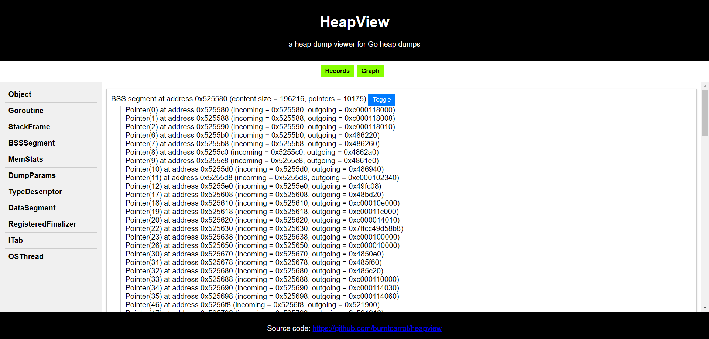
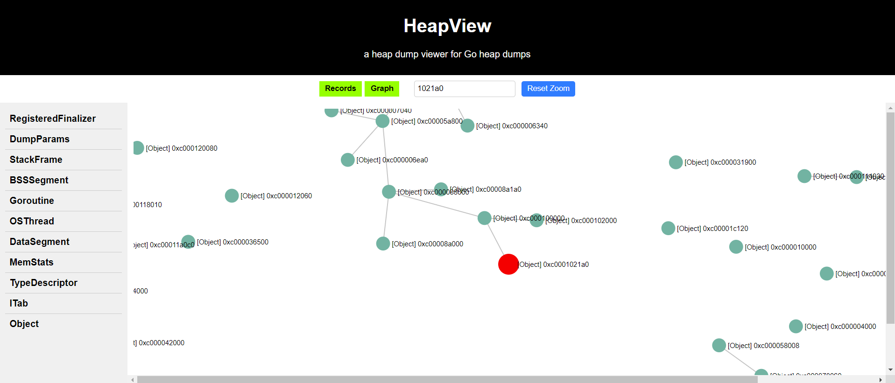

# heapview

A tiny, experimental heap dump viewer for Go heap dumps. (for heap dumps produced by `debug.WriteHeapDump()`)

Tested on Go 1.21.0.

## Installation

The easiest way to get started is to install `heapview` by downloading the [releases](https://github.com/burntcarrot/heapview/releases).

## Usage

```sh
heapview -file=<heapdump_path>
```

On running `heapview`, the server would serve the HTML view at `localhost:8080`:



Graph view:



## Future work

`heapview` is a small tool, but can be improved with the following features:

- a good, responsive Object Graph viewer, which could redirect to the record on interactions with the nodes
- a way to extract type information from the heap dumps
- an easier way to be in sync with the Go runtime changes 

If you'd like to contribute to the following, please consider raising a pull request!

## Acknowledgements

- https://github.com/golang/go/wiki/heapdump15-through-heapdump17, which documents the current Go heap dump format. (and was the main reference while I was building [heaputil](https://github.com/burntcarrot/heaputil))
- https://github.com/golang/go/issues/16410, the Go heap dump viewer proposal
- https://github.com/adamroach/heapspurs, which aims to provide a set of utilities to play around with the Go heap dump.